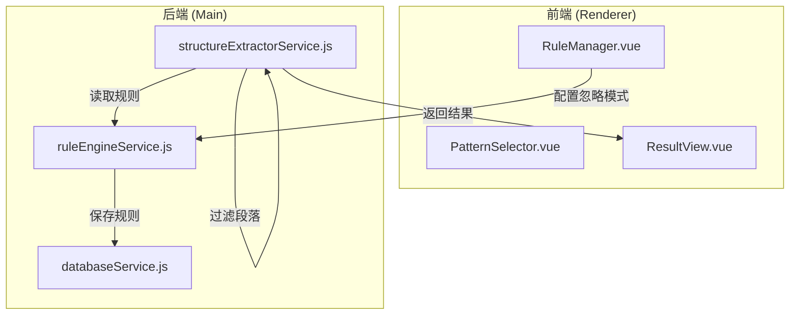

# Design Document: 忽略解析文本功能

## Overview

本设计文档描述"忽略解析文本"功能的技术实现方案。该功能允许用户在规则配置中定义忽略模式，解析时自动跳过匹配这些模式的文本，防止说明性文字被错误识别为题目。

## Architecture



## Components and Interfaces

### 1. 规则数据结构扩展

在现有规则的 `patterns` 对象中添加 `ignorePatterns` 字段：

```javascript
// 规则数据结构
{
  id: string,
  name: string,
  description: string,
  patterns: {
    levels: [...],           // 现有：题号级别配置
    bracket: [...],          // 现有：括号模式
    underline: [...],        // 现有：下划线模式
    ignorePatterns: [        // 新增：忽略模式
      {
        pattern: string,     // 正则表达式或关键词
        type: 'regex' | 'keyword',  // 模式类型
        description: string  // 可选：模式描述
      }
    ]
  }
}
```

### 2. RuleManager.vue 组件扩展

在规则编辑对话框中添加"忽略解析文本"配置区域：

```javascript
// 新增数据字段
currentRule.patterns.ignorePatterns = []

// 新增方法
function addIgnorePattern(pattern)
function removeIgnorePattern(index)
function validateIgnorePattern(pattern)
```

### 3. structureExtractorService.js 扩展

添加段落过滤逻辑：

```javascript
/**
 * 检查段落是否应该被忽略
 * @param {string} text - 段落文本
 * @param {Array} ignorePatterns - 忽略模式数组
 * @returns {Object} { ignored: boolean, matchedPattern: string|null }
 */
function shouldIgnoreParagraph(text, ignorePatterns)

/**
 * 过滤段落列表
 * @param {Array} paragraphs - 段落数组
 * @param {Array} ignorePatterns - 忽略模式数组
 * @returns {Object} { filtered: Array, ignored: Array }
 */
function filterParagraphs(paragraphs, ignorePatterns)
```

### 4. ruleEngineService.js 扩展

添加忽略模式验证：

```javascript
/**
 * 验证忽略模式数组
 * @param {Array} ignorePatterns - 忽略模式数组
 * @returns {Array} 验证后的有效模式数组
 */
function validateIgnorePatterns(ignorePatterns)
```

## Data Models

### IgnorePattern 模型

```typescript
interface IgnorePattern {
  pattern: string;           // 匹配模式（正则或关键词）
  type: 'regex' | 'keyword'; // 模式类型
  description?: string;      // 可选描述
}
```

### 预设忽略模式

```javascript
const PRESET_IGNORE_PATTERNS = [
  {
    pattern: '答案.*答题卡',
    type: 'regex',
    description: '答题卡相关说明'
  },
  {
    pattern: '注意事项',
    type: 'keyword',
    description: '注意事项标题'
  },
  {
    pattern: '作答前.*阅读',
    type: 'regex',
    description: '作答前阅读提示'
  },
  {
    pattern: '考试结束.*监考',
    type: 'regex',
    description: '考试结束说明'
  },
  {
    pattern: '不得在试题卷上.*作答',
    type: 'regex',
    description: '禁止在试卷作答提示'
  }
]
```

### 解析结果扩展

```typescript
interface ExtractResult {
  questions: Question[];
  levelMapping: object;
  ignoredParagraphs: Array<{  // 新增
    text: string;
    matchedPattern: string;
    paragraphIndex: number;
  }>;
}
```


## Correctness Properties

*A property is a characteristic or behavior that should hold true across all valid executions of a system—essentially, a formal statement about what the system should do. Properties serve as the bridge between human-readable specifications and machine-verifiable correctness guarantees.*

### Property 1: 忽略模式过滤正确性

*For any* 段落文本和忽略模式列表，如果段落文本匹配任一忽略模式（正则或关键词），则该段落应被标记为已忽略，且不应出现在最终的题目列表中。

**Validates: Requirements 2.1, 2.2, 2.3**

### Property 2: 忽略模式保存完整性

*For any* 有效的忽略模式配置，保存规则后重新读取，应得到相同的忽略模式列表。

**Validates: Requirements 1.3**

### Property 3: 无效正则过滤

*For any* 忽略模式数组，其中包含无效的正则表达式，验证函数应过滤掉所有无效模式，只保留有效模式。

**Validates: Requirements 3.2, 3.3**

### Property 4: 解析结果包含忽略信息

*For any* 文档解析操作，返回结果应包含 ignoredParagraphs 数组，记录所有被忽略的段落及其匹配的模式。

**Validates: Requirements 5.1**

### Property 5: 空忽略模式不影响解析

*For any* 文档和空的忽略模式列表，解析结果应与不配置忽略模式时完全相同。

**Validates: Requirements 2.4**

## Error Handling

### 无效正则表达式

- 在保存规则时，尝试编译每个正则表达式
- 编译失败的模式将被过滤掉，并在控制台输出警告
- 用户界面显示验证错误提示

### 空模式处理

- 空字符串模式将被忽略
- 只包含空白字符的模式将被忽略

### 匹配异常处理

- 正则匹配时捕获异常，防止单个模式错误影响整体解析
- 记录匹配错误到日志

## Testing Strategy

### 单元测试

使用 Vitest 进行单元测试：

1. `shouldIgnoreParagraph` 函数测试
   - 测试关键词匹配
   - 测试正则匹配
   - 测试空模式列表
   - 测试无匹配情况

2. `validateIgnorePatterns` 函数测试
   - 测试有效正则
   - 测试无效正则过滤
   - 测试空数组

3. `filterParagraphs` 函数测试
   - 测试混合段落过滤
   - 测试全部过滤
   - 测试无过滤

### 属性测试

使用 fast-check 进行属性测试：

1. **Property 1**: 生成随机段落和模式，验证匹配逻辑一致性
2. **Property 2**: 生成随机规则配置，验证保存/读取一致性
3. **Property 3**: 生成包含有效和无效正则的数组，验证过滤正确性
4. **Property 4**: 生成随机文档，验证返回结构完整性
5. **Property 5**: 生成随机文档，验证空模式不影响结果

每个属性测试运行至少 100 次迭代。
