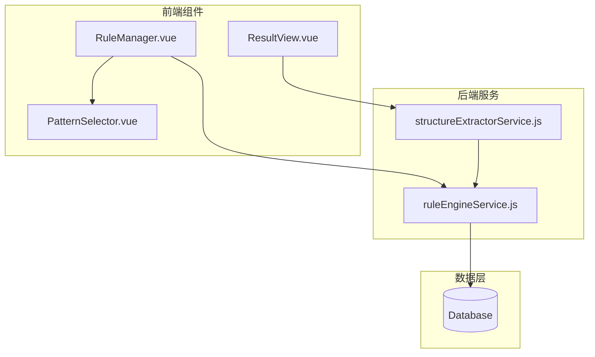
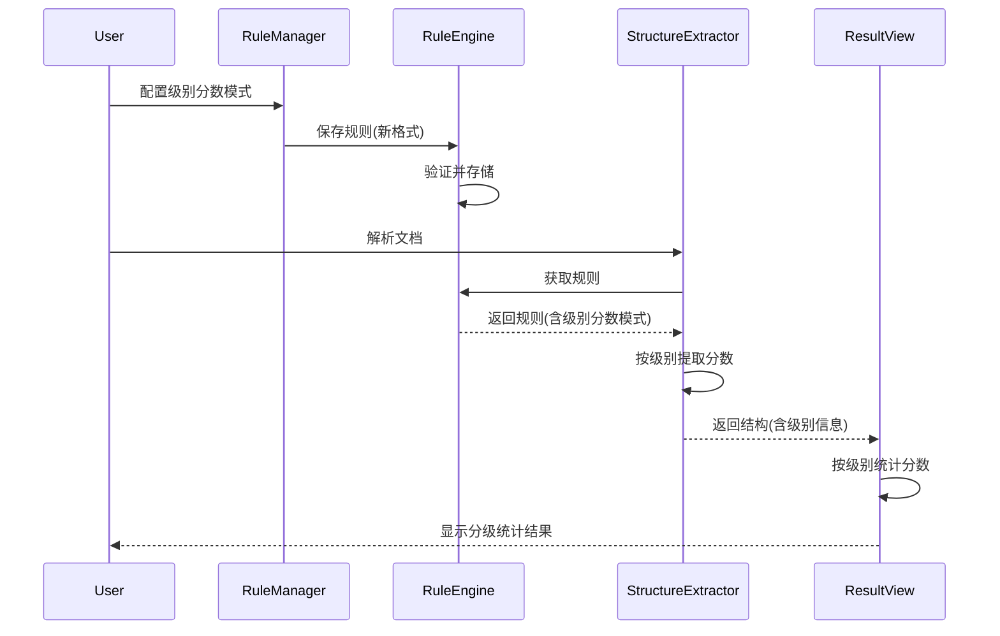

# Design Document: 分数模式按级别配置

## Overview

本设计改进规则管理系统，将分数模式从全局配置改为与题号级别关联的配置。每个题号级别可以配置独立的分数提取规则，分数统计按级别分类显示，分数详情与题目结构保持一致的层级展示。

## Architecture

### 系统架构图



### 数据流



## Components and Interfaces

### 1. RuleManager.vue 改动

**改动点：** 将分数模式配置从全局移到每个题号级别内部

```vue
<!-- 改动前：分数模式在 el-collapse 中作为独立项 -->
<el-collapse-item title="分数模式" name="score">
  <PatternSelector v-model="currentRule.patterns.score" category="score" />
</el-collapse-item>

<!-- 改动后：分数模式在每个级别内部 -->
<div v-for="(level, index) in currentRule.patterns.levels" :key="index" class="level-item">
  <div class="level-header">
    <span class="level-title">{{ level.name }}</span>
  </div>
  <!-- 题号模式 -->
  <div class="level-section">
    <span class="section-label">题号模式</span>
    <PatternSelector v-model="level.patterns" category="question" />
  </div>
  <!-- 分数模式（新增） -->
  <div class="level-section">
    <span class="section-label">分数模式</span>
    <PatternSelector v-model="level.scorePatterns" category="score" />
  </div>
</div>
```

**接口变更：**
- `addLevel()`: 创建新级别时初始化 `scorePatterns: []`
- `resetCurrentRule()`: 重置时包含 `scorePatterns` 字段

### 2. 数据结构变更

**旧格式：**
```javascript
{
  patterns: {
    levels: [
      { name: '一级题号', patterns: [] },
      { name: '二级题号', patterns: [] }
    ],
    score: [],      // 全局分数模式
    bracket: [],
    underline: []
  }
}
```

**新格式：**
```javascript
{
  patterns: {
    levels: [
      { 
        name: '一级题号', 
        patterns: [],
        scorePatterns: []  // 级别专属分数模式
      },
      { 
        name: '二级题号', 
        patterns: [],
        scorePatterns: []
      }
    ],
    bracket: [],
    underline: []
    // 移除全局 score 字段
  }
}
```

### 3. ruleEngineService.js 改动

**新增迁移函数：**
```javascript
/**
 * 迁移旧格式数据到新格式
 * @param {Object} oldPatterns - 旧格式模式配置
 * @returns {Object} 新格式模式配置
 */
function migrateToLevelScorePatterns(oldPatterns) {
  // 如果已经是新格式，直接返回
  if (oldPatterns.levels?.[0]?.scorePatterns !== undefined) {
    return oldPatterns
  }
  
  // 获取旧的全局分数模式
  const globalScorePatterns = oldPatterns.score || []
  
  // 为每个级别添加分数模式（默认使用全局模式）
  const newLevels = (oldPatterns.levels || []).map(level => ({
    ...level,
    scorePatterns: [...globalScorePatterns]
  }))
  
  return {
    levels: newLevels,
    bracket: oldPatterns.bracket || [],
    underline: oldPatterns.underline || []
    // 不再包含全局 score 字段
  }
}
```

**修改 validatePatterns：**
```javascript
function validatePatterns(patterns) {
  // 先迁移旧格式
  const migrated = migrateToLevelScorePatterns(migratePatterns(patterns))
  
  // 验证新格式
  return {
    levels: validateLevelsArrayWithScore(migrated.levels),
    bracket: validatePatternArray(migrated.bracket),
    underline: validatePatternArray(migrated.underline)
  }
}

function validateLevelsArrayWithScore(levels) {
  if (!Array.isArray(levels) || levels.length === 0) {
    return [
      { name: '一级题号', patterns: [], scorePatterns: [] },
      { name: '二级题号', patterns: [], scorePatterns: [] },
      { name: '三级题号', patterns: [], scorePatterns: [] }
    ]
  }
  
  return levels.map((level, index) => ({
    name: level.name || `${index + 1}级题号`,
    patterns: validatePatternArray(level.patterns),
    scorePatterns: validatePatternArray(level.scorePatterns || [])
  }))
}
```

### 4. structureExtractorService.js 改动

**修改 extractWithStyles 函数：**
```javascript
function extractWithStyles(styledParagraphs, rule) {
  // ... 现有代码 ...
  
  // 获取级别配置（包含分数模式）
  const levelConfigs = rule?.patterns?.levels || []
  
  // 在分配最终级别时，同时记录该级别的分数模式
  allQuestions.push({
    // ... 现有字段 ...
    level: finalLevel,
    levelConfig: levelConfigs[finalLevel - 1] || null,
    score: extractScoreByLevel(text, levelConfigs[finalLevel - 1]?.scorePatterns)
  })
}

/**
 * 按级别配置提取分数
 * @param {string} text - 文本
 * @param {Array} scorePatterns - 该级别的分数模式
 * @returns {number|null} 分数或 null
 */
function extractScoreByLevel(text, scorePatterns) {
  if (!scorePatterns || scorePatterns.length === 0) {
    return null
  }
  
  for (const pattern of scorePatterns) {
    try {
      const regex = pattern instanceof RegExp ? pattern : new RegExp(pattern)
      const match = text.match(regex)
      if (match) {
        // 提取数字
        const numMatch = match[0].match(/\d+/)
        if (numMatch) {
          return parseInt(numMatch[0], 10)
        }
      }
    } catch (e) {
      console.warn('无效的分数模式:', pattern)
    }
  }
  
  return null
}
```

### 5. ResultView.vue 改动

**新增级别统计计算：**
```javascript
// 按级别统计
const levelStats = computed(() => {
  const stats = new Map()
  
  function processQuestion(question) {
    const level = question.level || 1
    if (!stats.has(level)) {
      stats.set(level, {
        level,
        levelName: `${level}级题号`,
        totalCount: 0,
        withScoreCount: 0,
        totalScore: 0
      })
    }
    
    const stat = stats.get(level)
    stat.totalCount++
    if (question.score) {
      stat.withScoreCount++
      stat.totalScore += question.score
    }
    
    // 递归处理子题目
    if (question.children) {
      question.children.forEach(processQuestion)
    }
  }
  
  (props.result?.structure || []).forEach(processQuestion)
  
  return [...stats.values()].sort((a, b) => a.level - b.level)
})
```

**修改分数统计面板模板：**
```vue
<el-tab-pane label="分数统计" name="scores">
  <div class="scores-panel">
    <!-- 总体统计 -->
    <el-descriptions :column="2" border>
      <el-descriptions-item label="总题数">{{ totalQuestions }}</el-descriptions-item>
      <el-descriptions-item label="有分数的题目">{{ questionsWithScore }}</el-descriptions-item>
      <el-descriptions-item label="识别到的分数总和">{{ totalScore }} 分</el-descriptions-item>
      <el-descriptions-item label="解析耗时">{{ result.parseTime }} ms</el-descriptions-item>
    </el-descriptions>
    
    <!-- 按级别统计（新增） -->
    <div class="level-stats">
      <h4>按级别统计</h4>
      <el-table :data="levelStats" style="width: 100%">
        <el-table-column prop="levelName" label="级别" width="120" />
        <el-table-column prop="totalCount" label="题目数" width="100" />
        <el-table-column prop="withScoreCount" label="有分数题目" width="120" />
        <el-table-column prop="totalScore" label="分数总和" width="100">
          <template #default="{ row }">
            {{ row.totalScore }} 分
          </template>
        </el-table-column>
      </el-table>
    </div>
    
    <!-- 分数详情（改为树形） -->
    <div class="score-list">
      <h4>分数详情</h4>
      <el-tree
        :data="treeData"
        :props="{ children: 'children', label: 'number' }"
        default-expand-all
      >
        <template #default="{ node, data }">
          <div class="score-tree-node">
            <span class="node-number">{{ data.number }}</span>
            <span class="node-content">{{ truncate(data.content, 40) }}</span>
            <el-tag v-if="data.score" type="warning" size="small">{{ data.score }}分</el-tag>
            <el-tag type="info" size="small">{{ data.level }}级</el-tag>
          </div>
        </template>
      </el-tree>
    </div>
  </div>
</el-tab-pane>
```

## Data Models

### Rule 数据模型

```typescript
interface Rule {
  id: string
  name: string
  description: string
  patterns: PatternConfig
  isDefault: boolean
  createdAt: string
  updatedAt: string
}

interface PatternConfig {
  levels: LevelConfig[]
  bracket: string[]
  underline: string[]
}

interface LevelConfig {
  name: string           // 级别名称，如 "一级题号"
  patterns: string[]     // 题号匹配模式
  scorePatterns: string[] // 分数匹配模式（新增）
}
```

### Question 数据模型

```typescript
interface Question {
  id: string
  level: number
  number: string
  content: string
  fullText: string
  score: number | null
  paragraphIndex: number
  fontSize: number
  isBold: boolean
  sortKey: number
  baseLevel: number
  subLevel: number
  levelConfig: LevelConfig | null  // 新增：关联的级别配置
  children: Question[]
}
```

### LevelStats 数据模型

```typescript
interface LevelStats {
  level: number
  levelName: string
  totalCount: number
  withScoreCount: number
  totalScore: number
}
```

## Correctness Properties

*A property is a characteristic or behavior that should hold true across all valid executions of a system-essentially, a formal statement about what the system should do. Properties serve as the bridge between human-readable specifications and machine-verifiable correctness guarantees.*

### Property 1: 级别操作数据完整性

*For any* 规则配置，当添加或删除题号级别时，每个级别都应该包含有效的 `patterns` 和 `scorePatterns` 数组。

**Validates: Requirements 1.2, 1.3**

### Property 2: 分数提取使用正确级别模式

*For any* 题目和规则配置，提取的分数应该是使用该题目所属级别的 `scorePatterns` 匹配得到的结果。

**Validates: Requirements 2.1**

### Property 3: 空分数模式返回 null

*For any* 题目，如果其所属级别的 `scorePatterns` 为空数组，则该题目的 `score` 应该为 `null`。

**Validates: Requirements 2.2**

### Property 4: 多模式匹配优先级

*For any* 能匹配多个分数模式的文本，提取结果应该是第一个匹配模式的结果。

**Validates: Requirements 2.3**

### Property 5: 级别统计计算正确性

*For any* 题目结构，按级别统计的题目数量之和应该等于总题目数，按级别统计的分数之和应该等于总分数。

**Validates: Requirements 3.2**

### Property 6: 数据格式迁移往返一致性

*For any* 旧格式规则数据，迁移到新格式后导出再导入，应该得到等价的数据结构。

**Validates: Requirements 5.1, 5.2, 5.3**

## Error Handling

| 错误场景 | 处理方式 |
|---------|---------|
| 无效的分数模式正则 | 跳过该模式，记录警告日志 |
| 级别索引越界 | 返回 null，不抛出异常 |
| 旧格式数据缺失字段 | 使用默认空数组填充 |
| 分数提取无匹配 | 返回 null |

## Testing Strategy

### 单元测试

1. **ruleEngineService 测试**
   - 测试 `migrateToLevelScorePatterns` 函数的迁移逻辑
   - 测试 `validateLevelsArrayWithScore` 函数的验证逻辑
   - 测试导入导出的格式转换

2. **structureExtractorService 测试**
   - 测试 `extractScoreByLevel` 函数的分数提取
   - 测试不同级别使用不同分数模式的场景

3. **ResultView 计算属性测试**
   - 测试 `levelStats` 的计算逻辑

### 属性测试

使用 fast-check 进行属性测试，每个属性测试至少运行 100 次迭代。

**测试标签格式：** `Feature: score-pattern-by-level, Property N: {property_text}`

1. **Property 1 测试**：生成随机的级别添加/删除操作序列，验证数据结构完整性
2. **Property 2 测试**：生成随机的题目和规则配置，验证分数提取使用正确的级别模式
3. **Property 3 测试**：生成空分数模式的级别配置，验证返回 null
4. **Property 4 测试**：构造能匹配多个模式的文本，验证优先级
5. **Property 5 测试**：生成随机的题目树结构，验证统计计算
6. **Property 6 测试**：生成旧格式数据，验证迁移往返一致性
